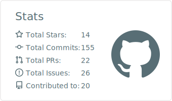

<h1 align="center">Arpit Agarwal</h1>

<h3 align="center">Mobile + AI Engineer</h3>

  Android & Kotlin · Native macOS & Swift · AI-powered product engineering

  <a href="https://arpitagarwal1301.github.io"><strong>Portfolio</strong></a>
  ·
  <a href="https://www.linkedin.com/in/arpitagarwal1301/"><strong>LinkedIn</strong></a>
  ·
  <a href="mailto:arpitvinshu@gmail.com?subject=Opportunity%20for%20Arpit"><strong>Email</strong></a>

  <em>Open to impactful full-time roles and selected freelance engagements.</em>

## About

I am a product-minded mobile software engineer and technology enthusiast who turns ambitious ideas into polished, dependable software. My foundation is Android and Kotlin, with recent work spanning native macOS products, reusable Swift packages, and privacy-conscious AI integrations.

**Focus:** Android & Kotlin · Swift & SwiftUI · Platform-native UX · AI integrations · Architecture · Testing & delivery

Currently building native products and developer tools across mobile, macOS, and AI—see the pinned projects below.

## GitHub activity

  

## Let’s connect

If you are building an ambitious mobile or AI-enabled product—or hiring for a team that values thoughtful engineering—**[send me an email](mailto:arpitvinshu@gmail.com?subject=Let%27s%20build%20something%20useful)** or **[connect with me on LinkedIn](https://www.linkedin.com/in/arpitagarwal1301/)**.
